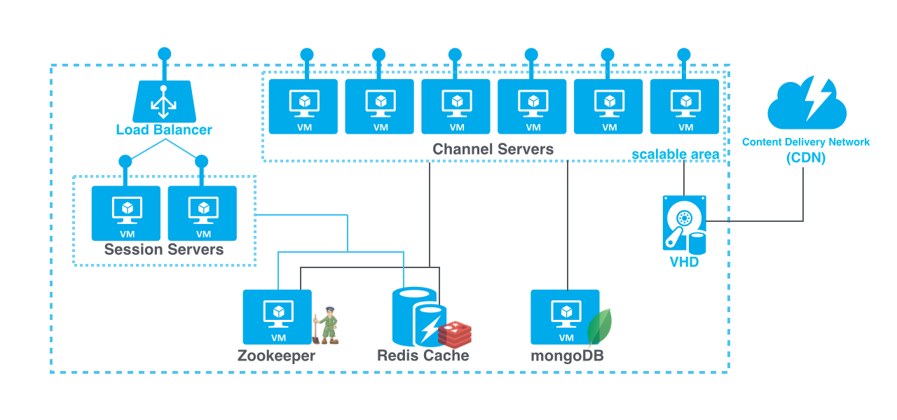

XPUSH는 무엇인가?
======================

  

`XPUSH`는 실시간 데이터 통신 플랫폼입니다. `XPUSH`를 기반으로 채팅, 메신져, 실시간 상황판 등 다양한 실시간 서비스를 서버 개발 없이 개발할 수 있습니다.

웹에서 실시간 데이터 통신 기을능 구현하기 위해서는 HTML5 표준 Websocket 으로 구현하거나, `node.js` 의 `socket.io` 모듈을 사용하여 어렵지 않게 구현할 수 있습니다.
하지만, 실시간 서비스에는 고려해야 할 것들이 상당히 많이 있습니다. 급격히 증가하는 사용자를 고려한 분산 서버 구성, 대용량 네트워크 트래픽 처리, 무중단 서버 확장(Scale-out) 등 다양한 것들을 고려해야 할 것입니다.
`XPUSH`는 실시간 데이터 통신을 위해 구현해야 할 필수 기능들과 확장성을 고려하여 구축되었습니다.

`XPUSH`는 `node.js`로 개발되었으며, `socket.io` 모듈로 실시간 메시지 통신을 가능하도록 구현하였습니다. 
그리고 접속 사용자 및 장치 관리, 접속 인증 및 송/수신 데이터 저장 등의 기능이 구현되어 있으므로, 이를 기반으로 다양한 실시간 서비스를 개발할 수 있도록 되어 있습니다

  

일반적으로 실시간 메시지 통신은 대량의 네트워크 트래픽을 처리 할 수 있어야 하며, 사용자가 늘어나면서 급격하게 트래픽이 증가할 수 있습니다. 
그러므로, `XPUSH`는 부하 분산을 위하 여다수의 서버가 구동될 수 있도록 해야 하며, 무중단 확장 가능하도록 설계되어 있습니다. 

`XPUSH` 는 분산 서버들의 실시간 코디네이션을 위하여 zookeeper 를 사용하고 있으며, 
서버에 연결되어 있는 정보를 실시간 저장하고 기본데이터를 캐쉬하기 위하여 `Redis` 를 사용합니다. 
그리고, 다양한 형태의 비정형 통신 메시지를 저장하기 위하여 `MongoDB` 를 사용하고 있습니다.

`XPUSH` 를 구성하는 서버들은 내부적으로 `Session 서버`와 `Channel 서버`로 구분되어 실행될 수 있습니다. 
`Session 서버`는 사용자 접속을 위한 인증과 사용자 관리 및 부하 분산을 위한 서버 분배 할당을 처리합니다. 
그리고 `Channel 서버`는 실제로 데이터 송수신을 하기 위해 Client 가 연결을 유지하는 서버 입니다. 

Client 는 실시간 메시지 통신을 하기 위하여, 가장 먼저 `Session 서버`를 호출하여 접속할 `Channel 서버`를 할당 받게 됩니다. 실제로 메시지를 송/수신하게될 서버는 `Channel 서버`이므로, `Session 서버`에 비하여 상대적으로 접속 Client 수에 비례하여 Scala-out 되어야 할 것입니다. 

보다 자세한 설명은 [2. XPUSH Live Chat Platform](docs/2-xpush/index.md)에서 다루게 될 것입니다.