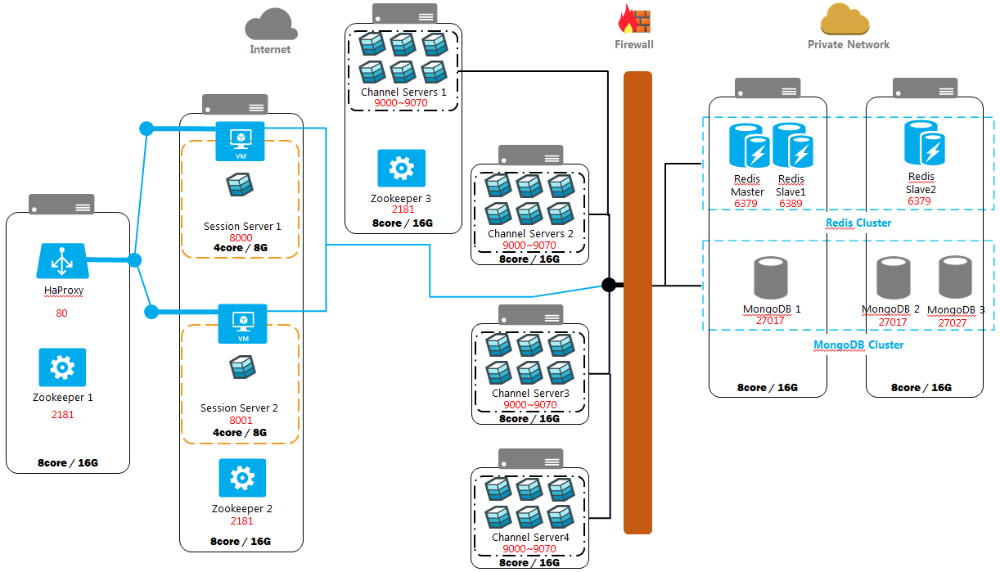
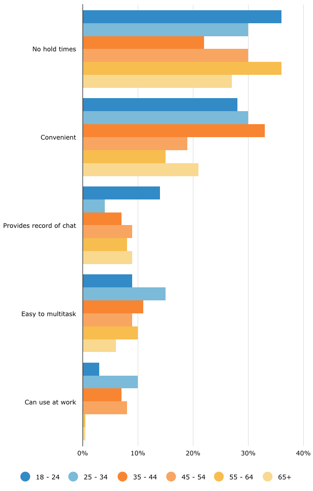
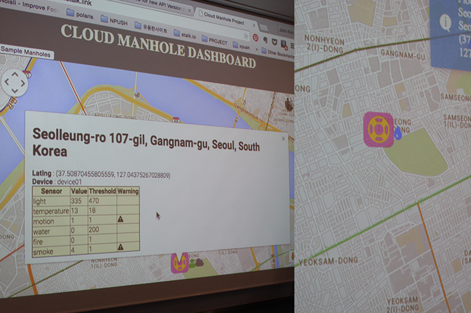

# I. XPUSH 와 API 소개

## 1.1 소개 

XPUSH는 eXtended Push의 약자이며, 대용량 분산 환경에서 실시간으로 데이터 송수신을 처리하기 위하여 개발되었다. MIT 라이선스(MIT License) 오픈소스로 누구라도 무상으로 취급 및 사용이 가능하다.

실시간으로 즉시 데이터를 송수신 해야하는 요구는 채팅, 실시간 상황판, 모바일 알림 등 다양한 영역에 걸쳐 존재하며, 실제로 게임에서 복수의 캐릭터의 동작이나 화면을 동기화 하는데 사용되거나, 채팅에서의 메시지 발송 및 수신 등에서 많이 활용되고 있다.

실시간 데이터 통신을 위해서는 아래와 같은 기능들이 필요하다.
- 데이터 송수신, 데이터 저장 및 조회
- 접속 사용자 및 Device 관리
- 접속을 위한 인증 처리 및 Session 관리

XPUSH는 이러한 필수적인 기능들을 모아 별도의 서버로 구축하여 플랫폼화한 것이다. 이러한 플랫폼을 기반으로 다양한 실시간 서비스를 쉽고 빠르게 개발하도록 하는 것이 본 프로젝트의 목표이다.

플랫폼에 구현된 기능들은 필수 기능과 서비스 기능으로 구분되어 있다. 필수 기능은 모든 서비스에 공통적으로 사용될 수 있는, 서비스에 종속되지 않은 기능이고, 서비스 기능은 플랫폼에 영향을 주지 않는 각각의 서비스에 해당하는 기능이다.

## 1.2 XPUSH 구성요소 및 기반기술

XPUSH는 node.js 기반으로 개발되었으며, 부하분산 및 메시지 저장을 위해 다양한 오픈소스를 활용하고 있다.

### 1.2.1 세션서버와 채널서버
XPUSH는 크게 세션 서버와 채널 서버로 나눌 수 있다. Session Server는 접속해야할 채널서버에 대한 목록을 가지고 있으며, 최적의 채널서버로 할당해주는 역할을 담당한다. 채널서버는 실제로 채팅에 필요한 기능들을 제공하는 서버이다.


### 1.2.2 Zookeeper
Zookeeper는 메모리를 이용하기 때문에 데이터에 대한 엑세스가 빠르고, 또한 분산 락이나 동기화에 대한 데이터의 안정성을 보장한다. 

XPUSH는 분산 서버들의 실시간 코디네이션을 위하여 zookeeper 를 사용하고 있다. 각 세션서버는 Zookeeper 의 특정 노드를 watching 하게 되고, 채널 서버의 변경이 발생할 경우, 활성화된 채널 서버의 정보를 실시간으로 동기화 하는 기법을 이용하여, 무중단으로 서버를 추가하거나 확장할 수 있도록 설계되어 있다.


### 1.2.3 Redis
Redis는 메모리 기반의 Key/Value 저장소이다. 모든 데이터가 메모리가 있어 데이터에 대한 빠른 Access를 보장하기 때문에 DB 쿼리후 결과를 저장하는 Cache나 세션 Storage 용도로 활용되고 있다.

XPUSH는 서버에 연결되어 있는 정보를 실시간 저장하고 기본데이터를 캐쉬하기 위해 Redis를 사용합니다. redis cluster를 구성할 경우에 효율적으로 data를 엑세스할 수 있도록 설계되어 있습니다.


## 1.3 XPUSH 설치

XPUSH는 패키지 형태로 제공되어 있기 때문에, npm 을 이용하여 쉽게 설치가 가능하다. 아래는 linux 환경에서 xpush를 설치하기 위한 방법을 다루고 있다.

```
git clone https://github.com/xpush/xpush-chat.git
cd xpush-chat
npm install
```

# II. XPUSH 관련 기술 동향

## 1.1 WebSocket을 이용한 실시간 데이터 처리

과거의 실시간 데이터 처리는 아래의 방식으로 이루어지고 있었다.

### 1.1.1 폴링(Polling) 방식 
브라우저가 일정한 주기로 HTTP로 요청을 보내는 방식으로, 실시간 데이터의 업데이트 주기를 예측하기 어렵기 때문에 불필요한 서버 요청이 다수 발생할 수 있다. 메시지가 갱신되는 기간을 정확히 알수 있는 경우에는 적합하지만 채팅같이 임의로 발생하는 경우에는 적합하지 않다.

### 1.1.2. 롱폴링(Long Polling) 방식
HTTP 요청 시 서버는 해당 요청을 일정 시간 동안 대기 시킨다. 대기 시간 안에 데이터가 업데이트되었다면, 클라이언트에게 응답을 보내고 서버로 재요청을 시작한다. 일정 시간 동안 메시지가 발생하지 않으면 응답을 보내고 다시 요청받는다. 데이터의 업데이트가 빈번하거나 데이터가 큰 경우 폴링에 비해 성능상 이점이 크지 않다.

### 1.1.3. 스트리밍 방식
서버는 지속적인 업데이트를 위하 무한정 요청을 대기시키며, 연결을 유지시킨다. 이에 데이터 전송 과정에서 불필요한 많은 양의 오버헤드를 발생시키며, 대기시간에 따른 성능저하가 발생한다.

### 1.1.4. WebSocket의 등장

HTTP프로토콜의 경우 연결을 유지하지 않는 특성때문에 10번 요청을 보내면 10번 연결을 맺고 끊는 과정이 필요하기 때문에, 모든 요청에 헤더가 들어가게 되어서 낭비가 발생할 수 있다. WebSocket은 HTTP와 달리 첫 연결 후 지속적으로 연결이 유지되기 때문에 불필요한 오버헤드가 적게 발생하며, 양방향으로 통신이 가능하기 때문에 대기시간이 필요하지 않다.

## 1.2 이벤트 기반 프레임워크 nodejs

10k 프라플럼을 해결하기 위해서는 주요 병목 구간을 파악해야하는데, 대부분의 경우 IO나 Network Access에서 많은 비용이 발생하게 된다. 서버가 IO 처리를 하다가 지연이 발생하면 다른 요청들은 처리되지 못하고 대기하게 되는데, 이러한 문제를 위해 비동기 방식의 프로그램이 등장하게 되었다.

### 1.2.1. Nodejs의 비동기 처리
Nodejs 는 Google Chrome의 V8 엔진 기반으로 동작하는 단일 쓰레드(Single-Thread)의 비동기 네트워크 서버이다.  이벤트 루핑(Event Looping)을 이용하여 요청을 처리하는 도중 다른 요청을 받을 수 있으며, 요청이 완료된 후 Callback을 요청하여 처리 완료가 완료되었음을 알린다. 수많은 작업을 병렬처리 할 수 있도록 설계되어 있기 때문에, 수많은 클라이언트가 사용하는 채팅이나 메신져, FIDS 등의 서버에 최적화되어 있다고 할 수 있다.

### 1.2.3 io.js 의 등장
node.js TJ Fontain이 3대 리더를 맡은 2013년 이후 1년 이상 새버전이 릴리즈가 안되고 이슈가 처리가 안되는 현상이 있었다. 더 큰 문제는 언제 릴리즈될지 어떤 문제가 있고 어떻게 해결할 것인지에 대한 내용이 커뮤니티와 전혀 의사소통이 되지 않고 있었던 것이다. 이 과정에서 node의 핵심 컨트리뷰터였던 node와는 다른 운영방식을 통해 node의 이슈들을 해결하고자 하는 취지르 io.js 가 탄생하게 되었다. 기존의 node 가 Joyent라는 특정 회사에 속해 있던 것에 반해 오픈 거버넌스 모델로 운영하면서 투명하게 합의를 이루어 나가는 것이었다. 실제로 io.js가 성능 측정 결과 13% 정도 퍼포먼스가 더 뛰어남이 벤치마크 결과에서 나타나면서 node.js를 강력하게 위협하게 되었다. 실제로 nodejs의 최신 버젼이 0.12 버젼에서 머무는 동안에  io.js 는 1.0을 릴리즈하였다.

### 1.2.4 io.js와의 재통합

이렇게 분리하여 나가던 두 프로젝트는 2015년 5월 중순 node.js와 io.js의 커뮤니티들이 노드JS 재단(Noje.js Foundation)이라는 이름하에 서로 협력해 코드를 통합하기로 발표하였다. Joyent 라는 특정 회사의 소속이 아닌 재단이름 하에 개발을 이어나가기로 결정한 것이다. 이 이후 2015년 9월 8일  io.js 와 node.js 프로젝트가 결합되어 4.0.0 Stable 버전이 릴리즈되었다. 기존의 node.js는 0.X 버젼을 사용하고 있었고, io.js 는 3.x 버젼을 사용하고 있었기 때문에 충돌을 피하고자 4.0 버젼으로 출발하게 된 것이다.

v.0.12 에서 4.0.0 으로 바뀌면서 변화된 주요 내용은 아래와 같다.

#### 새로운 V8 Version
- 현재 크롬브라우져에서 사용 중인 V8 v4.5가 포함되었다.
- 화살표 함수 등의 새로운 ES6 기능이 기본적으로 활성화되었다.

#### LTS와 정기 릴리즈 주기
장기지원(LTS)과 정기 릴리즈주기가 생겼다. 릴리즈 버젼은 [SeemVer](http://semver.org/lang/ko/)의 룰을 따르며 6개월마다 새로운 stable 버젼을 위한 브랜치가 생성된다. LTS 버젼은 12개월마다 정기적으로 릴리즈 되며, 차기 버젼 릴리즈 후에 18개월 동안 관리된 이후에 unstable 버젼으로 돌아가는 방식이다. 이러한 LTS 버젼은 릴리즈 날부터 30개월 ( 12 + 18 )간 관리되기 때문에 운영환경에서 사용하기에 적합한 버젼이라고 할 수 있다.

# III. 프로젝트 추진 내용

## 3.1 팝콘TV 적용 테스트

실시간 개인 방송 플랫폼인 팝콘TV는 와우저라는 방송용 서버에 채팅기능을 더해서 서비스를 하고 있었다. 당시 방송방 하나당  500명이라는 사용자만 수용이 가능한 상황이었기에, 만명이상의 사용자가 하나의 방송을 보면서 채팅하는 기능을 추가하고자 하는 요구가 있어 XPUSH 를 적용하기 위한 테스트를 1월부터 약 5개월간 진행하였다.

### 3.1.1 플랫폼 설치

16core 32G의 서버 8대를 이용하여 인프라를 구성하였다.
HaProxy를 이용하여 세션 서버의 부하를 분산시켰고 mongoDB, redis 등을 리플리케이션 해서 많은 사용자가 동시에 접속해도 분산해서 처리할 수 있도록 설계하였다. 또한 채팅 메시지의 보안을 강화하기 위해 SSL을 적용하였다.



### 3.1.2 팝콘TV 전용 기능 구현

Adobe Air를 이용한 자체 클라이언트를 사용 중이었기에 Flash Socket.io를 이용하여 채팅 클라이언트를 구현하였으며, 그에 맞는 API를 제공하였다.

- 채팅방별 접속자 수 : 현재 채팅방에 접속한 인원을 표현해주기 위해 redis에 현재 채팅방의 접속자 수를 동기화하여 API형태로 서비스하였다.

- 사용자 정보 업데이트 : 팝콘 갯수에 따라 사용자의 등급이 변경되는 로직이 필요하여 특정 상황에 따라 사용자의 정보를 변경하는 로직을 추가하여 Socket API 형태로 제공하였다.

- 채팅방 정보 변경 : 채팅방 얼리기나 환경 세팅을 위한 API를 추가하였다.

- GUEST 채팅 금지 :
로그인 하지 않은 사용자가 채팅방에 접속했을 경우, 메시지를 보내지는 못하고 받기만 할 수 있도록 하는 로직을 추가하였다.

### 3.1.3 분산 서버 모니터링 구현

admin socket을 이용하여 서버별 사용자 수 ,서버별 메모리 사용량, 서버의 CPU 부하 상태, 전체 서비스의 총 사용자 수 등을 수집하였다. 이를 위한 harvester는 grafana와 influxDB를 이용하여 구현하여 실시간 대시보드 형태로 제공하였다.


### 3.1.4 실제 사용 테스트
- JSON 파싱 : Flash Socket.io 를 사용할 경우 JSON을 항상 Stringify 하여 넘기는 식으로 사용을 하고 있어 서버상에서 JSON 파싱을 제대로 하지 못해 JSON Parsing Exception이 발생하는 경우가 다수 있었다. JSON 이 아는 값이 넘어올 경우 JSON으로  Parsing하여 처리하는 로직을 추가하였다.

- 서버 정기 점검 이슈
서버 정기 점검 시 XPUSH를 사용하기 위한 프로세스를 제대로 실행시키지 않는 문제가 있었다. 이후 정기 점검에서는 문제가 되지 않도록 필요한 프로세스들을 시작 프로세스로 등록하여 정기 작업시 발생할 수 있는 주요 작업들을 간소화하였다.

- 채팅 클라이언트 이슈
폴리스가 접속시 이전에 발송하지 못한 메시지가 있을 경우, 무한 반복하여 메시지를 발송하는 로직이 클라이언트에 숨어 있어 서버 CPU에 큰 부하를 발생시키는 문제가 있었다. 해당 문제를 해결하고 다시 테스트를 하는데 많은 시간이 소요되었다.

3.1.5 성능 테스트 수행
약 10회 정도의 성능 테스트를 수행하였다. 사용자가 몰리는 시간인  17시 ~22시 경에 특정 방송에 대해 XPUSH 플랫폼을 이용하도록 설정을 변경하였고, 실제 사용자들이 방송을 보면서 채팅을 하는데 문제가 없는지 지속적으로 모니터링하였다.

200명 이하일 경우 적절한 부하 분산을 통해 채팅이 딜레이가 없이 잘 되는 것을 테스트 했으나 한 방에 사용자가 500 명이 몰리거나 한 채널 서버에 사용자가 500명이상이 몰릴 경우 CPU 사용량이 100%가 걸리면서 서비스에 딜레이가 걸리는 것이 확인되었다. 이때 사용된 채널 서버는 32개였다.


## 3.2 Android Library 및 샘플앱 개발

Android 어플리케이션에서 XPUSH 플랫폼을 이용한 채팅 서비스를 구현하고자 하는 니즈가 있어 Android를 위한 전용 Library개발을 시작하였다. ㅋ,크게 XPUSH의 XPushCore 모듈과 ChannelCore 모듈이 있으며, 소켓 연결 유지를 위한 XPushService, 받은 메시지를 처리하기 위한 Recevier등이 개발되었다.  약 4개월에 걸쳐 개발이 진행되었으며, 현재 0.0.2 버젼이 bintray.com을 통해 배포되어 있다. 주요 모듈과 기능들에 대해 알아보자.

### 3.2.1 XPushCore

XPush 플랫폼에서 제공하는 기능들 중에서 세션 서버가 제공하는 API와 Global Socket이 제공하는 이벤트들을 함수 형태로 제공한다. 주로 채팅방에 진입하기 전에 필요한 기능들을 다루고 있다. 주요 기능은 아래와 같다.

- 사용자 및 장치 관련 :  사용자 등록, 사용자 수정, 사용자 로그인 로그인, 장치 추가, 세션 정보 저장
- 친구 관련 : 친구 조회, 친구 추가 , 친구 삭제, 친구 목록 저장
- 채널 관련 : 채널 생성, 채널 목록 조회

### 3.2.2 ChannelCore

채널 서버가 제공하는 Socket Event들을 사용하기 쉽게 구현해 놓은 클래스이다. 주고 받는 모든 메세지는 사용자가 정의한 TABLE 내에 자동으로 저장이 되기 때문에 메시지에 대한 조회가 자유롭다. ChannelCore가 제공하는 주요 기능은 아래와 같다.

- 접속 관련 : 채널 접속, 채널에 사용자 초대, 채널에서 나가기
- 메시지 관련 : 메시지 발송, 이벤트 발송, 메시지 조회

### 3.2.3 XPushService

Global Socket의 접속을 항상 유지하기 위한 Service 클래스이다. 모바일 디바이스의 특성상 인터넷 연결이 끊어지는 현상이 발생할 수 있다. 이러한 문제를  해결하기 위해 Android의 알람 매니저(Alarm Manager)를 이용하여 5분 간격으로 Ping을 날려서 접속이 되지 않았을 경우 재접속을 시도하는 로직이 구현되어 있다. 또한 해당 Library 를 사용한 어플리케이션이 활성화되지 않았을 때에 메세지를 저장하고 Notification을 알려주는 기능이 구현되어 있다.

### 3.2.4 빌드인 Acvitity와 Fragment 

라이브러리의 사용시 필수로 필요한 기능들만 추철하여 추상 Class 형태로 구현하였다. 메시지나 친구 리스트, 채널 리스트 등을 저장된 DB에서 쉽게 조회해서 화면에 출력하기 위한 기능들을 구현해 놓았다. 라이브러리 사용자는 해당 기능을 구현 시에 추상 클래스를 이용하면 보다 쉽게 안드로이드 화면을 구현할 수 있다.

- XPushChannelsFragment : 채널 리스트를 조회하고 화면으로 나타낼 때 사용되는 추상 클래스이다. 
- XPushUsersFragment : 친구 리스트를 조회하고 화면으로 나타낼 때 사용되는 추상 클래스이다.
- XPushChatFragment : 채널 내의 메시지 리스트를 조회하고 화면으로 나타낼 때 사용도는 위한 추상 클래스이다.

### 3.2.4 SampleChat Application 개발

라이브러리 및 빌트인으로 제공되는 Fragment 들의 사용에 대한 이해를 돕기 위해 구현한 안드로이드 어플리케이션이다. 사용자 등록 부터 로그인, 친구 찾기, 친구 추가, 채팅방 생성, 1:1 채팅, 그룹 채팅 등 채팅 전반에 걸쳐 필요한 기본 기능들을 어플리케이션으로 구현하였다. 모든 소스는 github에 공개 되어 있기 때문에 라이브러리 사용자는 해당 어플리케이션을 직접 수정하거나 참조하여 본인 만의 채팅 어플리케이션을 쉽게 구현할 수 있다.

## 3.3 아이폰 라이브러리 개발

Edit Here


# IV. 프로젝트 성과

## 4.1 컨퍼런스 발표

각종 행사 및 컨퍼런스에서 XPUSH 및 공개SW에서 발표를 하여 공개SW의 가능성과 중요성에 대해 전파하였다.

### 4.1.1 숭실대 발표
- 공개SW 개발자대회를 준비하는 법에 대해 전년도 수상자 자격으로 강의
- 연락을 유지하던 한 개발자가 대학생 부문 동상을 수여함

### 4.1.2 나는 프로그래머다
- 실제 개발자로서의 경험에 대해 공유하고 팟캐스트를 이용하여 녹음함

### 4.1.3 PlayNode 발표
- 2015 Play Node.js 기반의 대용량 분산 서버 아키텍쳐 설계 사례의 주제로 400명을 대상으로 발표
- 채팅 솔루션을 사용하고자 하는 업체에서 컨택이 와서 향후 프로세스 진행중

### 4.1.4 동북아 오픈소스 포럼에서 발표
- 동북아 포럼에서 XPUSH의 기술과 커뮤니티 활용에 대해 소개
- 중국 개발자들 사이에서 많은 관심이 있었으며 실제 XPUSH를 설치해보고 테스트 하고 있는 과정

## 4.2 분산 알고리즘 개선

특정 서버로 사용자가 과도하게 집중되는 것을 방지하고자, 서버에 접속 중인 사용자의 수에 따라 동적으로 부하를 분산시킬 수 있는 알고리즘을 설계하여 적용하였음.
이를 통해 특정 서버 몰림 현상을 제거하고 안정적으로 접속을 분산시킬 수 있는 환경을 갖추게 되었음

- 접속자에 따른 서버의 부하레벨을 구간별로 설정
- 서버 부하레벨이 증가하면 서버의 가중치를 감소시킴. 반대로 부하레벨이 감소하면 서버의 가중치를 증가 시킴
- 햔제 서버의 가중치에 따라 가중 가중치가 높은 서버로 접속을 하도록 유도함.
- 가중치에 따라 고르게 분산이 되기 때문에 특정 서버 몰림 현상을 예방할 수 있음.

## 4.3 STALK.IO 서비스 오픈

STALK 은 블로그나 온라인 쇼핑몰을 운영하는 사람들이 해당 사이트를 방문한 사용자들과 새로운 경험을 제공해줄 수 있는 온라인 상담서비스이다.
모바일에서도 적합한 UI제공, 운영자용 안드로이드 앱 지원, 기존 전화 상담과는 다르게 모든 대화 내용을 실시간으로 분석하여 활용할 수 있다.

### 4.3.1 STALK의 추진 배경
온라인 채팅 상담 서비스의 수요는 모바일 메신져가 성장하게 된 원인과 같다고 할 수 있다. 사용자들이 전화대신 채팅을 선호하는 주요 이유로는 기다리는 시간이 없고, 편리하고, 다른 행동과 함께 병행할 수 있다는 점이 있다. 이렇게 물건을 사기전에 채팅을 이용하여 상담을 원하는 사용자의 요구와 이 사용자들과 새로운 경험을 하기를 원하는 쇼핑몰 운영자들을 위해 STALK이라는 서비스를 개발하게 되었다.



### 4.3.2 STALK의 경쟁상대
2015년 9월경 네이버에서는 네이버 샵에 입점한 사업주를 대상으로 채팅 서비스를 제공하는 `네이버 톡톡`을 출시했다. 아래는 `네이터 톡톡`과 STALK의 주요 기능을 비교분석한 장표이다. 

  |STALK|네이버 톡톡
---|:---:|:---:
채팅 |1:1 대화 가능 | 1:1 대화 가능
운영자 | 운영자를 여러명 둘 수 있음 | 운영자 한명
적용 범위 |모든 사이트에서 동일 기능 | 적용 네이버 N 샵 내부에서만 가능
통계| 실시간 방문자 통계 | 일자별 데이터 통계 
채팅 방법| 상품 페이지에서 채팅 가능 | 팝업 형태 채팅
부가 정보| 사용자 정보 확인 가능 | 
이벤트 | 실시간 이벤트 가능 | 
사이트 개수 | 여러 사이트를 동시 관리 가능 |
자동 응대 | Virtual Agent로 대응 |

### 4.3.3 STALK의 주요기능

사이트에 접속한 모든 고객과 실시간으로 채팅이 가능하다.
고객의 정보와 상담이력을 확인하면서 응대가 가능하다.
접속한 고객들의 정보를 실시간으로 분석이 가능하기 때문에 분석 도구로써 더욱 효율적이다.
상품을 보고 있는 고객의 화면에 실시간 프로모션을 전송할 수 있다.

### 4.3.4 STALK의 단계별 전략

- 중소 규모 쇼핑몰 채팅 상담을 제공하여 사용자를 확보함
- 모바일 앱 및 인앱 채팅 라이브러리를 지원해 자신만의 앱에도 채팅이 가능하도록 함
- 각 쇼핑몰의 데이터를 수집하여 분석함
- 분석한 자료를 토대로 Virtual Agent를 구현함

# V. 적용 분야

## 5.1 실시간 대시보드

XPUSH 실시간 데이터 전송 기능을 활용하면 실시간 성 데이터를 즉각 보여줘야하는 대시보드 형태의 서비스에서 활용이 가능하다. 공항에서 비행기 도착 정보를 알려줘야 하는 FIDS 나 야구 전광판, 주식 차트, 선박의 계기판 등 다양한 영역에서 활용할 수 있다.

## 5.2 기업용 메신저

2014년 실리콘 밸리를 강타한 Slack 이라는 채팅 서비스가 있다. SLACK이 발표한 통계자료에 따르면 사용자들은 하루 평균 10시간 SLACK을 사용한다고 한다. 전통적으로 IRC 오래된 커뮤니케이션 도구가 있었음에도, SLACK이 성공한 이유를 한마디로 정리하면 협업을 위한 도구라는 점이다. 슬랙의 주요 장점을 정리하면 아래와 같다.

- 채널이라는 개념을 도입하여 새로운 채널을 쉽게 생성하여 협업이 가능함
- UI 등의 요소를 직접 커스터마이징이 가능함
- github, dropbox 등의 외부 요소와 쉽게 연계가 가능
- 검색 기능을 제공하여 손쉽게 모든 내용을 검색할 수 있음

이렇게 협업을 점차 중요하게 여기는 업무 형태에 발 맞춰, 기업내 커뮤니케이션 수단을 강화하고자 하는 수요는 끊임없이 있다. SLACK은 많은 장점이 있지만 무료 버젼일 경우 만건 이하의 메세지만 저장이 가능하다는 단점에 있어, 어느 정도 성장한 중간 규모의 스타트업이 사용하기에 어려운 부분이 있다. 이러한 중간 이상의 규모의 스타트업들이 사내 전용 메신저를 제작하려고 할때, 또한 대기업들이 협업을 강화하기 위해 커스터마이징이 가능한 자체 메신저를 만들고자할 때, XPUSH 플랫폼은 큰 힘이 될 수 있을 것이다.

## 5.3 실시간 상담 서비스 그 이후..?

중소 규모의 쇼핑몰 뿐 아니라 쿠팡이나 11번가, 지마켓, GS홈쇼핑 같은 전용 콜센터를 운영하는 업체에도 적용할 수 있다. 상담원들의 상담 현황을 실시간으로 분석하여 가장 상담 횟수가 적은 상담원과 고객을 연결하는 방법을 사용하면 전화 상담을 대체할 수 있는 수단으로 활용할 수 있게 될 것이다.

## 5.4 IoT 서비스

XPUSH는 웹소켓 기반의 플랫폼이기 때문에 WIFI를 지원하는 각종 기기에서도 실시간으로 데이터를 전송할 수 있다. 다양한 센서를 부착한 IoT 장비를 이용하여 맨홀이나 가로등같은 주요 기물에 부착한다면 실시간 재난 알림 시스템을 구축하는데 적용할 수 있다.

 - 불꽃 감지 센서 : 화재 발생시 
 - 온도 센서 : 비이상적으로 온도가 높아지거나 낮아질 시 감지하여 알람 발생
 - 진동 센서 : 지진 발생시 감지하여 알람 발생
 - 가스 센서 : 유해 가스 유출시 감지하여 알람 발생
 - 수량 센서 : 하수도의 범람을 감지하여 알람 발생
 - 모션 센서 : 동물의 움직임을 감지하여 알람 발생



참조 및 출처

- http://cyberx.tistory.com/28
- http://mohwaproject.tistory.com/114
- http://www.websocket.org/quantum.html
- http://www.nextree.co.kr/p7292/
- http://bcho.tistory.com/
- http://blog.outsider.ne.kr/1102
- http://www.softwareadvice.com/resources/demographics-impact-live-chat-customer-service/
- http://www.itworld.co.kr/news/89006